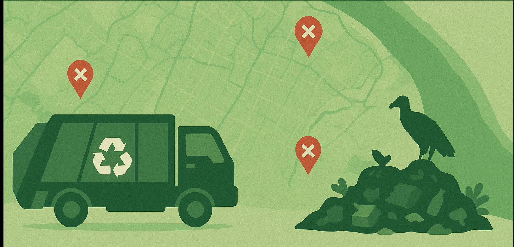

# Projeto: Coleta de Lixo e Descarte Irregular em Belém-PA

Este projeto é desenvolvido para o **Instituto I2A2** e tem como objetivo organizar, processar e visualizar dados sobre coleta de lixo e descarte irregular na cidade de Belém, Pará. Ele integra dados de setores de coleta, bairros e áreas geográficas para facilitar análise espacial e suporte à tomada de decisão.

## Objetivos

O projeto tem como objetivo mapear, integrar e analisar dados socioeconômicos,
geográficos e operacionais relacionados à coleta de lixo e ao descarte irregular nos bairros de
Belém–PA. A partir desses dados, o projeto busca identificar regiões vulneráveis,
apoiar a tomada de decisão e fornecer insumos para políticas públicas de forma independente da gestão
de resíduos sólidos.

## Motivação

Belém (PA) enfrenta uma crise persistente e urgente na gestão de resíduos sólidos, caracterizada pela alta ocorrência de descarte 
irregular. A cidade produz toneladas de lixo diariamente e contabiliza dezenas pontos críticos de descarte ilegal [i, 690, 671].
Embora o município busque soluções, ele não tem conseguido resolver o problema. 
O descarte ocorre em locais críticos, como em calçadas, ciclovias, e às margens de canais urbanos as consequências socioambientais
e de saúde são graves: mau cheiro proliferação de insetos, ratos e urubus  e a obstrução de canais e vias, que dificulta a locomoção
A raiz do problema está na fragilidade da política de saneamento e na falta de educação ambiental. As ações municipais são, em grande parte,
pontuais (como mutirões de limpeza), demonstrando falta de estratégias sistêmicas para atuar na gênese da dispersão.

## O que o projeto faz

* **Consolida diferentes bases de dados** (IBGE, webscraping da coleta, registros de descarte irregular).
* **Processa e organiza** informações socioeconômicas, demográficas e espaciais.
* **Calcula indicadores de vulnerabilidade**, como densidade populacional, renda, frequência de coleta e número de descartes.
* **Realiza análises estatísticas** para identificar fatores associados ao descarte irregular.
* **Gera mapas temáticos e visualizações interativas** para apoiar análises espaciais.
* **Fornece uma base estruturada** para desenvolvimento futuro de um painel interativo e sistema de monitoramento.

## Visualizações Interativas

Os mapas interativos gerados pelo projeto podem ser acessados diretamente nos links abaixo. Eles fornecem uma **análise espacial** detalhada sobre os pontos de descarte irregular e os indicadores de vulnerabilidade em Belém-PA.

### [Mapa Bairros & Parâmetros](https://albertoakel.github.io/data_ambiental/mapa_bairros_interativo_folium.html)
### [Mapa dos setores de Coleta](https://albertoakel.github.io/data_ambiental/mapa_setores_coleta.html)

## Documentos Importantes

### [Relatório 11/25](Relatorio.md)
### [Roteiro 11/25](guia.md)

---

## 📁 Estrutura do Projeto
```
📁 Data_ambiental/
├── 📂 data/
|   ├──process          # dados organizados ou processados
|   └──raw              # dados bruto, baixados ou coletados
├── 📂 docs/            # html 
├── 📂 image/   
├── 📂 notebook/       
├── 📂 sandbox/         # 
├── 📂 src/             # funcoes e codigos complementares
|   └──templates js     
├── 📂 video/   
└── README.md
```
## 💻 Como configurar o ambiente
> ⚠️ O arquivo `requirements.txt` contém todas as dependências para instalação do ambiente.

### Criando ambiente de desenvolvimento
```bash
conda create -n data_ambiental python=3.11
conda activate data_ambiental
```
### Instalando dependências 
via conda
```
conda install numpy pandas geopandas shapely folium requests aiohttp
```
ou via pip
```
pip install -r requirements.txt
```

## Licença
Este projeto (código, dados e mapas) é disponibilizado sob a licença **Creative Commons Attribution 4.0 International (CC BY 4.0)**.

Isso significa que o uso e a adaptação do material são permitidos para qualquer finalidade (inclusive comercial), **desde que a atribuição (citação) seja feita de forma apropriada**.
