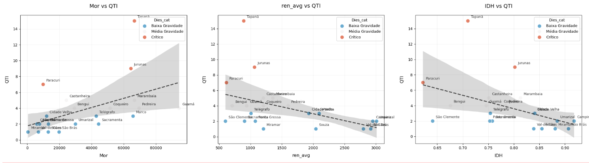
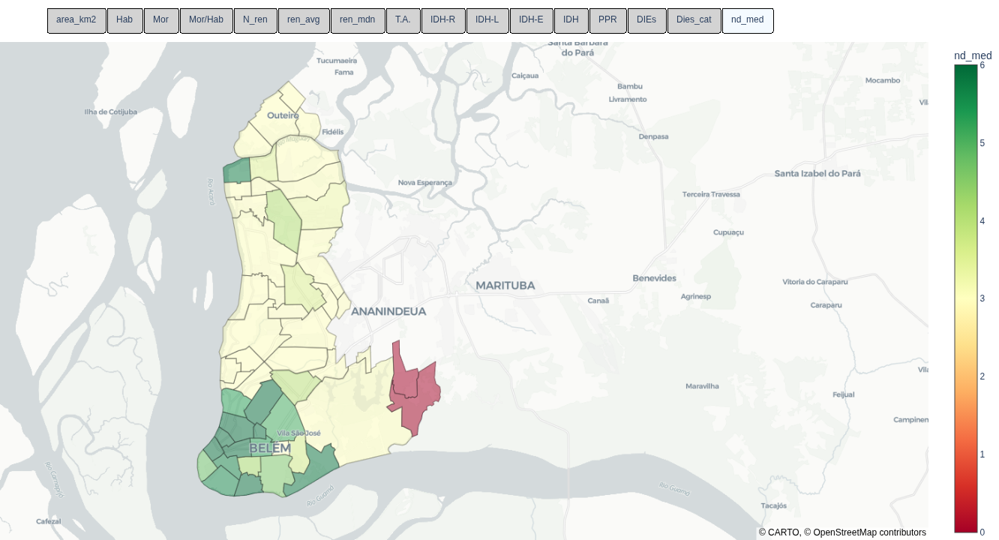

## Resumo Executivo e Técnico: Descarte Irregular de Lixo em Belém

O estudo socioeconômico e territorial dos bairros de Belém revela uma forte associação entre as condições de desenvolvimento humano e a ocorrência de Depósitos Irregulares de Entulho (DIEs). A análise indica que o descarte irregular está concentrado em áreas de menor desenvolvimento socioeconômico, sendo influenciado por um conjunto de fatores que incluem o tamanho do bairro, a densidade populacional e, de forma mais crítica, a renda e o Índice de Desenvolvimento Humano (IDH).

## Análise Descritiva e Estatística dos Fatores Determinantes

### 1. Indicadores Operacionais e a Realidade da Coleta

O panorama do descarte irregular em Belém é caracterizado por uma coleta de lixo insuficiente e uma dispersão significativa de pontos de descarte A frequência média de coleta é de 3,59 dias/semana, sendo que a grande maioria dos bairros (71,83%) possui um serviço parcial, entre 3 e 3,5 dias. Em paralelo, a quantidade de Depósitos Irregulares de Entulho (DIEs) apresenta uma média de 4,37 por bairro, com a maior parte deles registrando entre 3 e 5 pontos. A variável de Quantidade Registrada (QTI), com média de 3,81, confirma a concentração em valores baixos, porém generalizados. A **figura** 1 apresenta o mapa por dias da semana para coleta de lixo.

**Figura 1:** Mapa dos setores de coleta de lixo em Belém. Em verde 6 dias na semana. Em Amarelo 3 dias na semana. 

### 2.Padrão Socioeconômico: A Raiz do Problema

O tecido social de Belém é marcado por significativa desigualdade. A renda média da cidade é de R$ 1.194,20, mas a renda mediana é drasticamente menor, de R$ 698,88, um sinal claro da concentração de renda em patamares baixos. Com efeito, 80,28% dos bairros têm uma renda mediana de R$ 605,00 ou menos. A distribuição populacional também é desigual, com quase metade dos bairros (46,48%) abrigando até 5.132 moradores. O Índice de Desenvolvimento Humano (IDH) varia, com a maior parte dos bairros (cerca de 49%) concentrando-se em faixas consideradas médias. Figura 2 

**Figura 2:** Mapa dos Bairros de Belém da mediana da renda da populacao.

## Insights para o Descarte Irregular de Lixo

### A Influência Crítica da Renda e do Desenvolvimento Humano

Existe uma relação clara e estatisticamente significativa entre a prosperidade de um bairro e a ocorrência de descarte irregular. Bairros com maior renda média e melhor IDH tendem a registrar menos descarte irregular. Esta correlação negativa é evidenciada pelos coeficientes de `ren_avg` vs `QTI` ($r = -0,4406$) e `IDH` vs `QTI` ($r = -0,4399$). De forma mais ampla, a variável DIEs correlaciona-se negativamente com `IDH` ($r = -0,477$) e `ren_avg` ($r = -0,443$), reforçando que piores condições de vida estão intrinsecamente ligadas a maiores índices do problema. 

**Figura 3**: Relação entre Moradores, renda média, e IDH com QTI( Quantidade de Depósitos Irregulares)

### O Efeito Amplificador do Território e da Densidade Populacional

As características físicas e demográficas dos bairros atuam como um catalisador para o descarte irregular. Bairros com maior extensão territorial (`area_km2`) apresentam uma correlação positiva moderada ($r = 0,564$) com a existência de mais DIEs. O tamanho da população também é um fator de risco, com uma correlação positiva moderada entre `Mor` e `QTI` ($r = 0,4847$). Ademais, o adensamento residencial, medido por Moradores por Habitação (`Mor/Hab`), também mostra uma correlação positiva ($r = 0,420$), sugerindo que a falta de espaço para armazenamento doméstico contribui para o descarte em vias públicas.

**Figura 4**: Relação entre Area[km2], moradores/Habitantes e moradores com renda com QTI( Quantidade de Depósitos Irregulares)

### A Dinâmica do Abandono em Territórios Expansivos

A maior extensão territorial cria um ambiente propício para o descarte irregular devido a uma combinação de fatores. A logística de fiscalização torna-se desproporcional, resultando em baixa frequência de monitoramento e reduzida percepção de risco. Simultaneamente, a maior disponibilidade de terrenos baldios e espaços vaziosé percebida como uma oportunidade para o descarte clandestino, iniciando um "efeito contágio" de degradação. Este cenário é agravado pela infraestrutura viária deficiente em áreas periféricas de bairros grandes, que impede a circulação eficiente de caminhões de coleta e veículos de fiscalização, criando zonas de alta vulnerabilidade.

## Ações Estratégicas e Recomendações

### Enfrentando a Disparidade do Serviço de Coleta

A infraestrutura operacional desigual funciona como um gatilho direto para o descarte. A confirmação estatística de que uma menor frequência de coleta correlaciona-se com mais DIEs ($r = -0,2557$) sublinha a necessidade urgente de reestruturar o serviço. A solução passa por aumentar a frequência de coleta nos bairros periféricos de alta vulnerabilidade, equiparando-a ao padrão das áreas centrais.

**Figura 5**: Número de dias médios de coleta de lixo.

### Mitigando os Riscos Territoriais e Demográficos

Para combater o efeito amplificador do tamanho e da densidade, a gestão deve ser inteligente e focalizada. É crucial utilizar os dados de área (`area_km2`) e população (`Mor`) para direcionar a fiscalização e o monitoramento de forma proativa, especialmente em bairros maiores e mais populosos, contendo assim o efeito contágio em terrenos baldios.

### Atacando a Raiz Socioeconômica do Problema

A estratégia final e mais fundamental deve priorizar a alocação de recursos onde o problema é mais agudo. Dado que o descarte é significativamente maior em bairros com baixo IDH ($r \approx -0,477$) e baixa renda ($r \approx -0,443$), e que a maioria dos bairros tem renda mediana igual ou inferior a R$ 605,00, as políticas públicas devem ser canalizadas para estas áreas de vulnerabilidade, onde a carência de infraestrutura de suporte é mais crítica.

As políticas de intervenção devem, portanto, ser integradas e georreferenciadas, atacando de forma simultânea os fatores sociais, territoriais e operacionais para um resultado efetivo e duradouro.

# Próximas Etapas: Plataforma Interativa de Monitoramento

## Visão do Futuro: Da Análise à Ação em Tempo Real

Com base nas evidências sólidas obtidas através da análise socioeconômica e territorial, o projeto avança para uma fase operacional que transformará dados estáticos em ferramentas dinâmicas de gestão pública.

### 🎯 Objetivo Estratégico
Desenvolver uma **plataforma digital interativa** que permita o monitoramento contínuo e participativo do descarte irregular em Belém, criando um ciclo virtuoso de coleta, análise e ação.

---

## Arquitetura da Solução Proposta

### 1. **web aplicativo de Geolocalização**
**Funcionalidades principais:**
- Registro de descartes irregulares via fotos georreferenciadas
- Interface simplificada para população de diferentes níveis de alfabetização digital
- Sistema de notificação sobre andamento das denúncias

### 2. **Painel de Gestão Pública**
**Capacidades analíticas:**
- Visualização em tempo real de hotspots de descarte
- Cruzamento automático com indicadores socioeconômicos
- Alertas preditivos baseados em padrões históricos

## Valor Esperado da Plataforma

### 🚨 Para a Gestão Pública
- **Transparência**: Monitoramento público das ações de limpeza de forma independente
- **Otimização de recursos**: Direcionamento inteligente de equipes de fiscalização
- **Tomada de decisão baseada em evidências**: Dados em tempo real para políticas públicas

### 👥 Para a População
- **Canais de participação**: Ferramenta acessível para contribuir com a cidade
- **Retorno visível**: Acompanhamento das demandas resolvidas
- **Educação ambiental**: Informações sobre descarte adequado

## Plano de Implementação por Fases

### Fase 1: Protótipo Piloto (0-6 meses)
- Desenvolvimento do MVP 
- Validação com usuários reais
- Análise estratégica de feedback para pivotagem ou aprimoramento

### Fase 2: Expansão Controlada (6-12 meses)
- Integração com sistemas municipais
- Treinamento de equipes da prefeitura

### Fase 3: Escala Total (6-12 meses)
- Lançamento city-wide
- Campanhas de adoção em comunidades
- Análise de impacto e ajustes contínuos

## Inovação e Sustentabilidade

O projeto de mapeamento de descarte irregular de lixo, ao integrar Ciência Cidadã e Inteligência Territorial, estabelece uma base profundamente inovadora para a gestão urbana, especialmente relevante no contexto das urgências climáticas e da bioeconomia amazônica. A participação da população como um sensor ambiental ativo transforma a coleta de dados, que passa de um processo dispendioso e esporádico para um fluxo contínuo e em tempo real. Essa abordagem de crowdsourcing não só reduz drasticamente o custo de manutenção da base de dados (sendo totalmente web-based), como também promove um novo modelo de Governança Aberta, onde a transparência no ciclo de gestão de resíduos é reforçada pelo envolvimento direto do cidadão.

O descarte irregular em áreas urbanas, particularmente em cidades costeiras como Belém, contribui para o entupimento de drenagens, agravando inundações durante eventos climáticos extremos e poluindo rios e estuários. Ao identificar e mitigar esses pontos de descarte com precisão e rapidez, o projeto se torna uma ferramenta de resiliência urbana, protegendo a infraestrutura da cidade contra os impactos do clima. Além disso, a capacidade de identificar padrões de resíduos pode orientar a bioeconomia, ao mapear materiais que poderiam ser reintegrados na cadeia produtiva local em vez de serem dispostos em lixões, estimulando novas parcerias e o desenvolvimento sustentável regional.

o modelo se destaca pela sua sustentabilidade operacional e escalabilidade. Sua tecnologia de baixo custo de manutenção permite que o projeto seja facilmente adotado por outras cidades da Amazônia que enfrentam desafios logísticos e ambientais semelhantes. O potencial para o estabelecimento de parcerias público-privadas é significativo, permitindo que empresas de reciclagem ou gestores de resíduos usem os dados em tempo real para otimizar suas operações, transformando a informação coletada em valor econômico e ambiental, e garantindo que o projeto evolua de uma análise de dados para uma solução de infraestrutura de dados essencial para a metrópole amazônica

--

