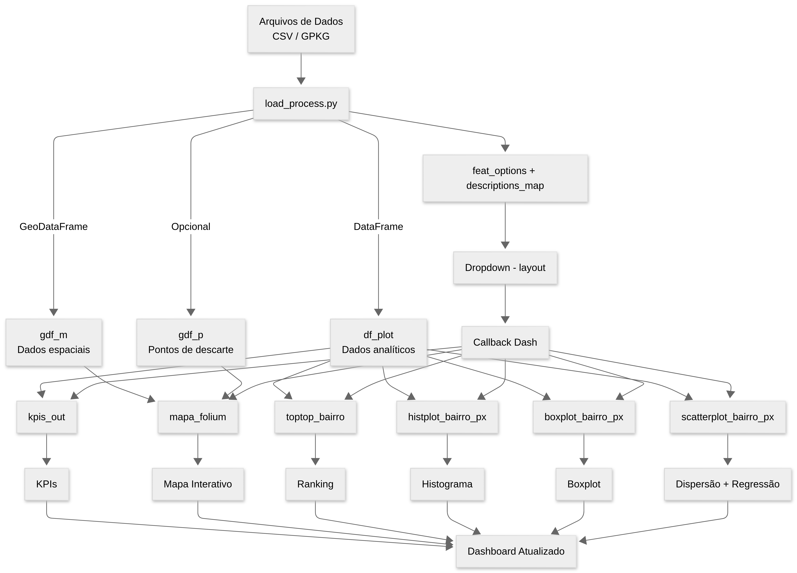

## Resumo Técnico da Aplicação

### Visão Geral

A aplicação consiste em um **dashboard interativo desenvolvido em Dash/Plotly**, voltado à **análise espacial, estatística e exploratória** de dados relacionados à coleta de lixo e ao descarte irregular nos bairros de Belém–PA. O sistema integra **dados socioeconômicos, operacionais e geográficos**, permitindo avaliar padrões territoriais, identificar áreas vulneráveis e apoiar processos de tomada de decisão e formulação de políticas públicas.

A arquitetura do código é **modular**, separando claramente as responsabilidades de **carregamento de dados, layout, lógica reativa (callbacks) e rotinas analíticas/visuais**, o que facilita manutenção, expansão e reprodutibilidade científica.


## 1. Estrutura de Diretórios

```
Dash_apps/
├── app_04.py          # Script principal (entrypoint)
├── load_process.py   # Leitura e processamento dos dados
├── layout.py         # Definição do layout do Dash
├── callbacks.py      # Callbacks reativos do Dash
├── fig_plots.py      # Funções de visualização (mapas e gráficos)
├── assets/
│   └── style.css     # Estilos CSS customizados
└── anaconda_projects/db
```

## 2. Arquitetura e Organização do Código



### A. Camada de Orquestração (`app_04.py`)

O arquivo `app_04.py` atua como **ponto de entrada da aplicação**, sendo responsável por:

* Inicializar o servidor Dash;
* Acionar o pipeline de leitura e processamento de dados;
* Construir o layout da interface gráfica;
* Registrar os callbacks que controlam a reatividade do dashboard.

Esse módulo **não executa análises nem gera gráficos**, limitando-se a coordenar os componentes do sistema, o que caracteriza uma separação clara entre lógica de controle e lógica analítica.

---

### B. Camada de Dados e Processamento (`load_process.py`)

O módulo `load_process.py` implementa o **pipeline de integração e preparação dos dados**, incluindo:

* Leitura de arquivos tabulares (`CSV`) e geoespaciais (`GPKG`);
* Integração de dados socioeconômicos, operacionais e territoriais por bairro;
* Construção de um **GeoDataFrame principal (`gdf_m`)**, utilizado exclusivamente para análises espaciais e mapas;
* Criação de um **DataFrame analítico (`df_plot`)**, sem geometria, destinado à geração de gráficos estatísticos;
* Cálculo de variáveis derivadas, como:

  * Percentual de moradores sem renda (`NS`);
  * Classificação de risco (`Risco`) baseada na intensidade de depósitos irregulares;
* Preparação de metadados analíticos (`feat_options` e descrições das variáveis), utilizados pelo componente de seleção interativa.

Opcionalmente, o módulo também incorpora um **GeoDataFrame de pontos de descarte irregular (`gdf_p`)**, permitindo a sobreposição de informações pontuais aos mapas coropléticos.

Essa camada define o **modelo de dados central da aplicação**, garantindo consistência entre análises espaciais e estatísticas.

---

### C. Camada de Interface Gráfica (`layout_01.py`)

O módulo `layout_01.py` é responsável pela **estrutura visual do dashboard**, definindo:

* Cabeçalho e descrição do painel;
* Componente de seleção de variáveis (Dropdown);
* Área de indicadores sintéticos (KPIs);
* Área de visualização espacial (mapa interativo);
* Conjunto de gráficos analíticos (ranking, histograma, boxplot e dispersão).

O layout é totalmente declarativo e **não contém lógica de processamento de dados**, utilizando apenas os identificadores (`id`) necessários para a ligação com os callbacks.

---

### D. Camada Reativa e de Controle (`callbacks.py`)

O módulo `callbacks.py` implementa a **lógica reativa da aplicação**, conectando a interface gráfica às rotinas analíticas. A partir da variável selecionada pelo usuário, o callback:

* Calcula indicadores sintéticos (KPIs);
* Atualiza descrições contextuais da variável analisada;
* Gera mapas coropléticos e sobreposição de pontos de descarte;
* Produz gráficos de ranking, distribuição e dispersão;
* Retorna todos os elementos atualizados ao layout.

Esse módulo funciona como o **núcleo lógico do dashboard**, coordenando as chamadas às funções analíticas e assegurando a atualização consistente de todos os componentes visuais.

---

### E. Camada Analítica e Visual (`fig_plots.py`)

O módulo `fig_plots.py` concentra as **rotinas estatísticas, gráficas e espaciais**, incluindo:

* Cálculo de estatísticas descritivas (média, mediana, extremos);
* Geração de gráficos Plotly (histogramas, boxplots, rankings e dispersões);
* Construção de mapas interativos com Folium (coropléticos por bairro);
* Análises de correlação e regressão linear, com:

  * Intervalos de confiança clássicos;
  * Opção de inferência via bootstrap;
* Padronização de paletas de cores e regras visuais.

As funções são implementadas de forma **modular e independente do Dash**, favorecendo reuso, testabilidade e replicação das análises fora do ambiente web.

---

## 3. Contribuição do Sistema ao Projeto

A aplicação permite:

* Integrar dados socioeconômicos, geográficos e operacionais em uma única plataforma;
* Identificar bairros com maior vulnerabilidade socioambiental;
* Avaliar a relação entre infraestrutura urbana, renda, coleta de lixo e descarte irregular;
* Visualizar padrões espaciais e estatísticos de forma acessível e interativa;
* Oferecer suporte técnico à formulação de políticas públicas e estratégias de intervenção estrutural, indo além de ações pontuais como mutirões de limpeza.

---

## Considerações Finais

O código apresenta uma **arquitetura bem definida, orientada a camadas**, adequada tanto para uso institucional quanto para produção científica. A separação entre dados, lógica analítica, controle reativo e interface garante **robustez, escalabilidade e clareza metodológica**, alinhando o desenvolvimento técnico aos objetivos estratégicos do projeto de enfrentamento da crise de resíduos sólidos em Belém–PA.


